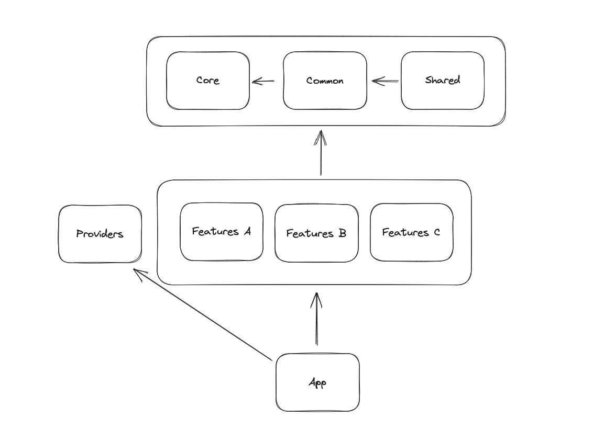
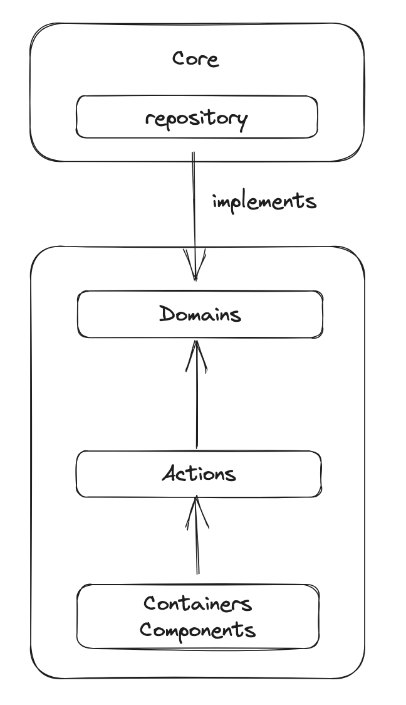

# Kormelon Blog

## 1. 소개 ✍️

본 프로젝트는 Next.js v14의 app router를 기반으로 작업되었으며 Prisma, Supabase를 활용한 풀스택 프로젝트입니다.

해당 프로젝트는 점진적으로 새로운 스택을 응용하고 아키텍처를 보완해 유지보수가 용이하도록 개선된 프로젝트입니다. 이전 버전에 대한 코드는 다음에서 확인할 수 있습니다.

- [kormelon-front](https://github.com/chkim116/kormelon-front)
- [kormelon-blog-back-v3](https://github.com/chkim116/kormelon-blog-back-v3)
- [kormelon-back](https://github.com/chkim116/kormelon-back)

이 프로젝트는 Vercel에 배포되어 운영 중이며 현재 개인 블로그로 사용 중입니다.

🏠 [바로가기](https://www.kormelon.com/blog)

## 2. 기술 스택 ⚡️

| 이름       | 버전    |
| ---------- | ------- |
| Next.js    | v14.0.3 |
| NextUI     | v2.2.9  |
| Tailwind   | v3.4.1  |
| TypeScript | v5.2.2  |
| Prisma     | v5.7.1  |

## 3. 폴더 구조 📦

폴더의 구조는 다음과 같습니다.

여기서 폴더란 `src`의 하위 폴더를 의미하며 구체적으론 실질적 업무 구성에 필요한 요소를 의미합니다.

`public`, `cypress`와 같은 폴더 그리고 기타 설정 폴더들에 대해서는 따로 언급하지 않습니다.

| 폴더명    | 역할                                                                     | 예                                                                |
| --------- | ------------------------------------------------------------------------ | ----------------------------------------------------------------- |
| core      | 웹 애플리케이션 외부에서 다뤄지는 영역                                   | 외부 라이브러리, 네트워크 통신, 환경변수, 브라우저 종속 기능      |
| common    | 웹 애플리케이션 내부에서 다뤄지나 특정 도메인에 종속 되지 않은 범용 영역 | Toast, Dialog, Icon, Loading 컴포넌트                             |
| shared    | 모든 도메인(feature)에서 접근 가능한 횡단 관심사 영역 모듈               | 유저 권한 조회                                                    |
| providers | 웹 애플리케이션의 구성을 위해 필요한 초기 설정 영역                      | 각종 Provider와 Global Styling                                    |
| features  | 사용자가 활동하는 도메인 영역별 모듈. 각 features는 독립적으로 관리      | 해당 도메인에서만 활용하는 interface, side effect, UI 컴포넌트 등 |
| app       | Page에 대한 Routes 설정 및 Next.js 규칙에 의거한 server side 작업        | MetaData 생성, 페이지 구성에 필요한 초기 값 fetching              |

위 설명에 따른 폴더 구조는 다음과 같습니다.

```
/src
├── core
├── common
├── shared
├── providers
├── features
└── app
```

> 위 6가지의 폴더를 두고 '모듈'이라 지칭하도록 하겠습니다.

### 3-1. 폴더의 상세 구조

#### common, shared, features 모듈

| 명칭       | 역할                                                                                    | 불가        |
| ---------- | --------------------------------------------------------------------------------------- | ----------- |
| components | UI 컴포넌트 모음                                                                        |             |
| containers | 컨테이너 컴포넌트 모음                                                                  | common 불가 |
| hooks      | 컴포넌트에 쓰이는 훅스 모음                                                             |             |
| actions    | Side Effect를 가지는 Use Case 모음                                                      | common 불가 |
| domains    | 도메인 구성에 필요한 인터페이스(uiState), 생성자(creator), 변환기(convertor), 서비스    | common 불가 |
| lib        | 도메인과 연관 없으나 업무를 위해 필요한 라이브러리를 어댑팅하거나 퍼사드(facade)한 객체 |             |
| constants  | 상수 모음                                                                               |             |
| services   | 도메인 구성을 위해 필요한 퍼사드(facade)한 객체                                         | common 불가 |
| utils      | 유틸리티 함수 모음                                                                      |             |

`common` 모듈에 불가한 폴더가 있는 이유는, 해당 모듈이 도메인과 직접적 연관이 없는 모듈이기 때문입니다. 앞서 말했듯 `common`은 웹 애플리케이션 내부에서 다뤄지나 특정 도메인에 종속 되지 않은 범용 영역이기 때문입니다.

#### core 모듈

| 명칭         | 역할                                                                       |
| ------------ | -------------------------------------------------------------------------- |
| entities     | DB 데이터 타입 정의                                                        |
| repositories | DB에 대한 직접적 통신을 수행하는 함수 및 repository에 대한 인터페이스 정의 |
| lib          | 업무를 위해 필요한 라이브러리를 어댑팅하거나 퍼사드(facade)한 객체         |
| env.ts       | 환경 변수                                                                  |

#### providers와 app 모듈

모듈 `providers`, `app`은 상세 구조가 정의되지 않았습니다. 이는 다양한 기능이 필요하지 않은 비교적 단순한 모듈이기 때문입니다.

먼저 `providers` 모듈의 역할은 프로젝트 초기 설정과 관련된 코드를 응집해 놓는 것입니다. 이는 Redux Provider나 SWR Config와 같은 글로벌한 영역의 설정을 의미합니다. 이러한 역할의 범주는 도메인을 구성하기 위해 필요한 모듈의 범주보다 작습니다. 즉 업무를 위한 구성 자체가 복잡하지 않기 때문에 상세 폴더 구조가 필요하지 않습니다.

둘, `app` 모듈은 단순히 page의 진입점 역할을 합니다. 그러므로 상세 구조가 불필요합니다. 대신 페이지 구성에 필요한 최소한의 컴포넌트 작업만 허용하며 Next.js의 경우 app router 규칙이 있으므로 이를 이행하고 있습니다.

### 3-2. 폴더 간 참조 원칙

각각의 모듈은 참조 방향의 원칙을 지킵니다. 이는 순환 참조 오류를 방지하기 위함과 동시에 관심사 분리를 통해 서로의 관심사만 알게 하기 위해서입니다. 이런 방식은 응집도를 높이고 결합도를 낮추는 효과를 얻을 수 있습니다.



> 화살표가 참조 방향입니다.

도메인 모듈인 `shared`, `features`는 다음의 모습으로 참조 관계를 유지해 페이지를 구성합니다.



위 이미지는 구조를 간략화한 것으로 일부 폴더 구조가 언급되지 않았음을 양해부탁드립니다.

## 4. 설치 🧑‍💻

```shell
git clone https://github.com/chkim116/kormelon-blog-front-v3.git

cd kormelon-blog-front-v3
```

본 프로젝트를 올바르게 실행하기 위해선 **최소 Node 20 버전이 필요**합니다. nvm을 사용한다면 `nvm use` 키워드를 활용하세요.

또한 패키지 관리자는 yarn이어도 무방하나, 최초 npm으로 설정되어 있어 **npm을 권장**합니다.

원활한 프로젝트 동작을 위해서는 `env.development` 파일에 대한 사전 설정이 필요합니다.

```
DATABASE_URL=prisma에 연결할 DB URL
DIRECT_URL=prisma에 연결할 DB URL

NEXTAUTH_URL=주소 (ex http://localhost:3000)
NEXTAUTH_SECRET=jwt암호화에 사용할 키

CLOUDINARY_NAME=
CLOUDINARY_PRESET=
CLOUDINARY_API_KEY=
CLOUDINARY_API_SECRET=
CLOUDINARY_URL=
```

다음 명령어를 이용해 시작합니다.

```shell
npm install && npm run db:migrate-dev && npm run dev
```
